# OptimizeSearchEngine

Optimize Search Engine" implemented with ReactJS.

Creating a ChatGPT application in React JS that uses search engines to optimize search results involves integrating OpenAI's GPT with external search APIs, processing the data, and displaying it within a React application. Below is a simplified roadmap to build such an application, focusing on key aspects like setting up the React environment, integrating the GPT model, fetching data from search engines, and displaying the optimized search results.

### 1. Environment Setup

First, ensure you have Node.js and npm installed on your machine. Create a new React application by running:

```bash
npx create-react-app chatgpt-search-optimizer
cd chatgpt-search-optimizer


```

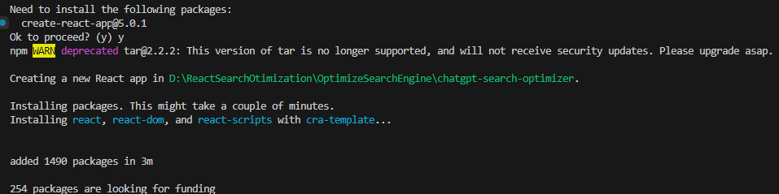
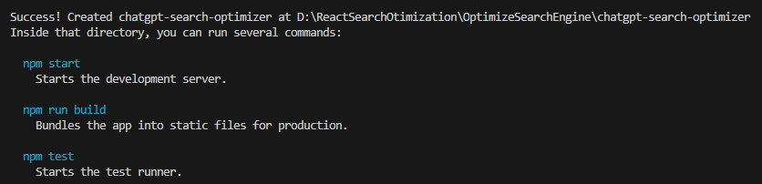
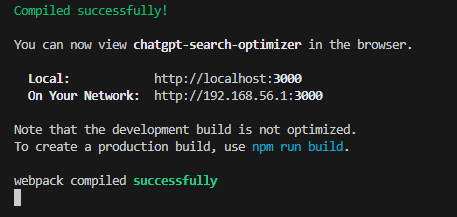
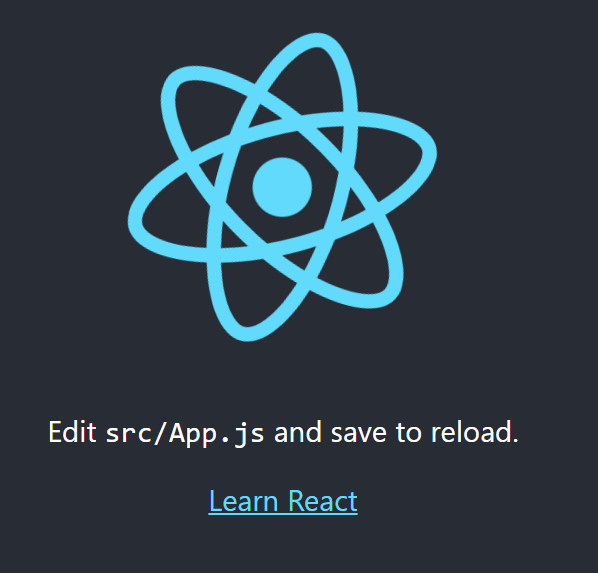

### 2. Backend Setup

Since OpenAI's API should be called from a backend to keep your API keys secure, set up a simple Express server.

- **Install Express:**
  Navigate to your project root and create a `server` folder. Inside this folder, initialize a new Node.js project and install Express.

  ```bash
  mkdir server && cd server
  npm init -y
  npm install express axios cors dotenv
  ```

  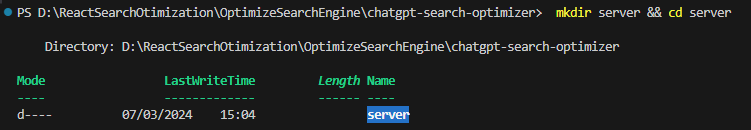
  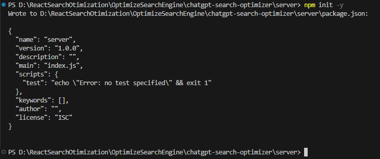
  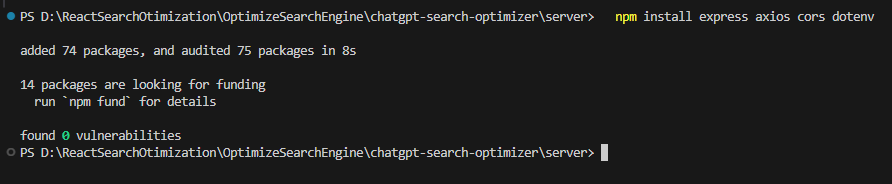
- **Server Code:**
  Create an `index.js` in the `server` directory. This server will act as a proxy between your React app and the OpenAI API.
  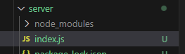

  ```javascript
  require('dotenv').config();
  const express = require('express');
  const axios = require('axios');
  const cors = require('cors');

  const app = express();
  app.use(cors());
  app.use(express.json());

  const OPENAI_API_KEY = process.env.OPENAI_API_KEY;

  app.post('/search-optimization', async (req, res) => {
    const query = req.body.query;
    try {
      // Integrate with an external search API or OpenAI's API
      const response = await axios.post('https://api.openai.com/v1/completions', {
        model: 'text-davinci-003',
        prompt: `Optimize the following search results for the query: ${query}\n\n1. Search result one...\n2. Search result two...\n3. Search result three...`,
        max_tokens: 150,
      }, {
        headers: {
          'Authorization': `Bearer ${OPENAI_API_KEY}`,
        },
      });
      res.json(response.data.choices[0].text);
    } catch (error) {
      console.error(error);
      res.status(500).send('Error processing the search optimization');
    }
  });

  const PORT = process.env.PORT || 3001;
  app.listen(PORT, () => {
    console.log(`Server running on port ${PORT}`);
  });
  ```
- **Environment Variables:**
  Create a `.env` file in your `server` directory to securely store your OpenAI API key.
  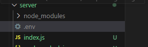

  ```
  OPENAI_API_KEY=your_openai_api_key_here
  ```

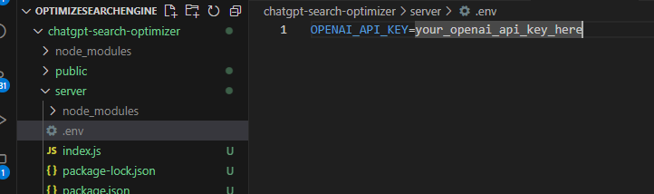

### 3. React Frontend Setup

- **Proxy Configuration:**
  To make requests to your backend, add a proxy to your React app's `package.json` to avoid CORS issues.

  ```json
  "proxy": "http://localhost:3001",
  ```

  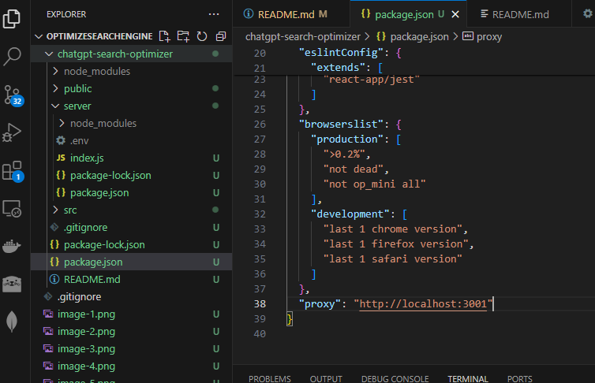
- **Search Component:**
  Create a search component that takes user input and sends a request to your backend, which in turn calls the OpenAI API.

  ```javascript
  import React, { useState } from 'react';
  import axios from 'axios';

  const SearchOptimization = () => {
    const [query, setQuery] = useState('');
    const [results, setResults] = useState('');

    const handleSearch = async () => {
      try {
        const response = await axios.post('/search-optimization', { query });
        setResults(response.data);
      } catch (error) {
        console.error('Error fetching optimized results:', error);
      }
    };

    return (
      <div>
        <input
          type="text"
          value={query}
          onChange={(e) => setQuery(e.target.value)}
          placeholder="Enter search query"
        />
        <button onClick={handleSearch}>Optimize Search</button>
        <div>{results}</div>
      </div>
    );
  };

  export default SearchOptimization;
  ```

  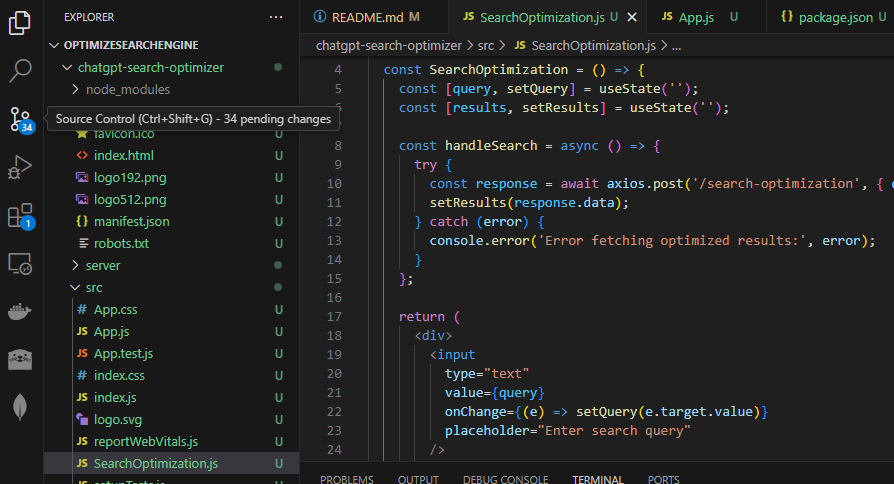
  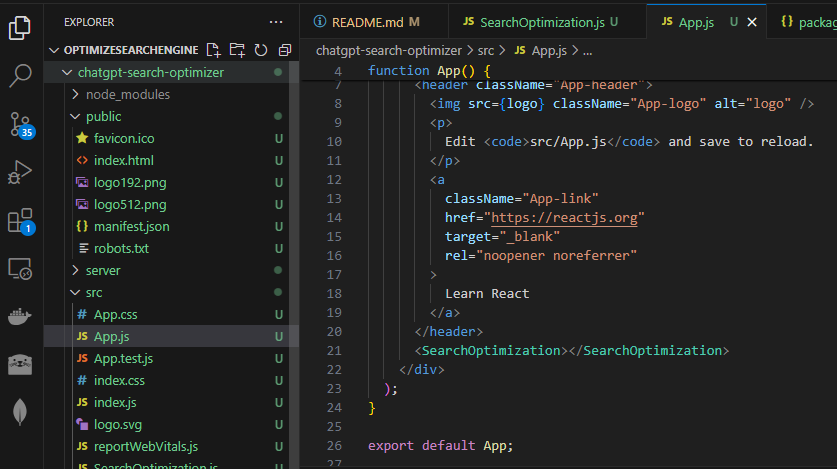
- **Integration:**
  Integrate this component into your App.js or any other component as needed.

  ```javascript
  import logo from './logo.svg';
  import './App.css';
  import SearchOptimization from './SearchOptimization';
   function App() {
     return (
       <div className="App">
         <section className="App-search">
         <SearchOptimization></SearchOptimization>
         </section>
       </div>
     );
   }

  export default App;

  ```

### 4. Running the Application

- Start your backend server from the `server` directory:

  ```bash
  node index.js
  ```
- Run your React application:

  ```bash
  npm start
  ```

This simplified guide provides a foundational structure for a ChatGPT-driven search optimization application in React. Depending on the complexity of your project, you might need to adjust the search optimization logic, handle security considerations more robustly, and potentially scale the backend to handle multiple concurrent requests efficiently.

